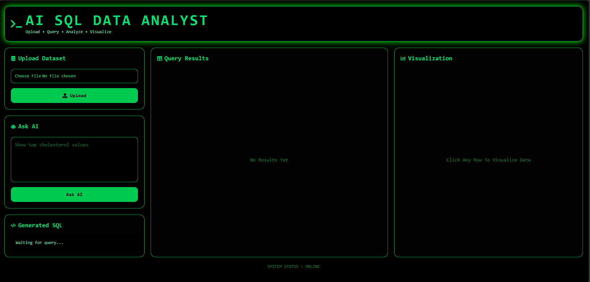
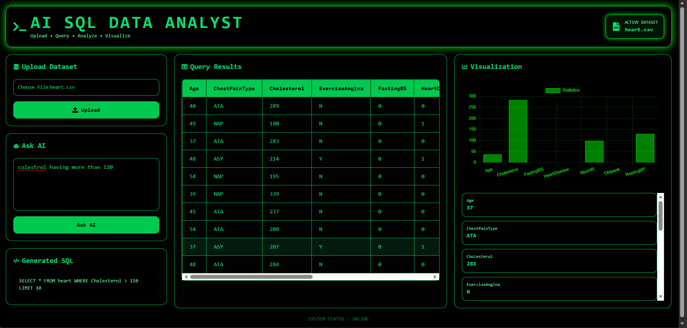

# AI SQL Data Analyst

AI SQL Data Analyst is an intelligent full-stack AI-powered analytics platform that allows users to upload CSV datasets, ask questions in natural language, automatically generate SQL queries using LLMs, and visualize insights interactively.

The system combines Artificial Intelligence, SQL automation, data visualization, and full-stack web development into a single interactive analytics dashboard.

---

# 🚀 Features

- 📂 Upload CSV datasets dynamically
- 🤖 Ask questions in natural language
- 🧠 AI-generated SQL queries using Groq LLM
- 🗄️ Automatic SQLite database creation
- 📊 Interactive query result tables
- 📈 Dynamic statistical visualizations
- 🖱️ Row-click chart generation
- 💻 Retro terminal-inspired UI
- 📱 Fully responsive dashboard
- ⚡ Real-time data analysis experience

---

# 📸 Project Screenshots

## Dashboard Interface



---

## AI Visualization & Query Results



---

# 🧠 How It Works

```text
CSV Upload
   ↓
Dataset Converted to SQLite
   ↓
User Asks Question
   ↓
Groq LLM Generates SQL
   ↓
SQL Executes on Database
   ↓
Results Sent to Frontend
   ↓
Tables + Charts Rendered
```

---

# 🛠️ Tech Stack

## Frontend

- React.js
- Vite
- Tailwind CSS
- Axios
- React Icons
- Chart.js
- React ChartJS 2

## Backend

- Flask
- Flask-CORS
- Pandas
- SQLite3
- Python Dotenv
- Groq API

## AI Model

- Llama 3.3 70B Versatile
- Powered by Groq

---

# 📦 Installation

## 1️⃣ Clone Repository

```bash
git clone https://github.com/your-username/AIDataAnalyst.git

cd AIDataAnalyst
```

---

# ⚙️ Backend Setup

```bash
cd backend

pip install -r requirements.txt

python app.py
```

---

# 💻 Frontend Setup

```bash
cd frontend

npm install

npm run dev
```

---

# 🔐 Environment Variables

Create a `.env` file inside the backend folder:

```env
GROQ_API_KEY=your_groq_api_key
```

---

# 📂 Project Structure

```text
AIDataAnalyst/
│
├── backend/
│   ├── app.py
│   ├── requirements.txt
│   ├── database/
│   └── .env
│
├── frontend/
│   ├── src/
│   ├── public/
│   ├── package.json
│   └── vite.config.js
│
└── README.md
```

---

# 🔥 Core Functionalities

## 📂 Dataset Upload

Users can upload CSV datasets dynamically, which are automatically converted into SQLite database tables.

## 🤖 AI SQL Generation

Natural language questions are converted into valid SQL queries using Groq-powered LLMs.

## 📊 Query Execution

Generated SQL queries are executed directly on uploaded datasets.

## 📈 Interactive Visualization

Users can click any row in the table to generate dynamic statistical bar charts.

## 💻 Responsive Dashboard

Modern retro-style dashboard interface optimized for desktop and mobile devices.

---

# 📡 API Endpoints

## Upload Dataset

```http
POST /upload
```

Uploads CSV datasets and stores them inside SQLite.

---

## Ask Question

```http
POST /ask
```

Generates SQL from natural language questions and returns analyzed results.

---

# 🎯 Example Questions

```text
Show top 10 cholesterol values

Find average age

Display highest salary records

Show total sales by category

Find records where age is greater than 50
```

---

# 🚀 Future Enhancements

- AI-generated insights
- Multiple chart support
- PDF report generation
- Authentication system
- Cloud database integration
- Advanced dashboard analytics
- Export visualization reports

---

# 📚 Applications

- Business Intelligence
- Healthcare Analytics
- Educational Data Analysis
- Research Visualization
- AI-assisted SQL Learning
- Interactive Analytics Dashboards

---

# 👨‍💻 Developed Using

- React + Flask Architecture
- Generative AI
- SQL Automation
- Interactive Data Visualization
- Full Stack Development

---

# ⭐ Conclusion

AI SQL Data Analyst demonstrates the integration of AI-powered SQL generation, data visualization, and full-stack web technologies into a single intelligent analytics platform.

The project simplifies data analysis by allowing users to interact with datasets using natural language instead of manually writing SQL queries.

---
